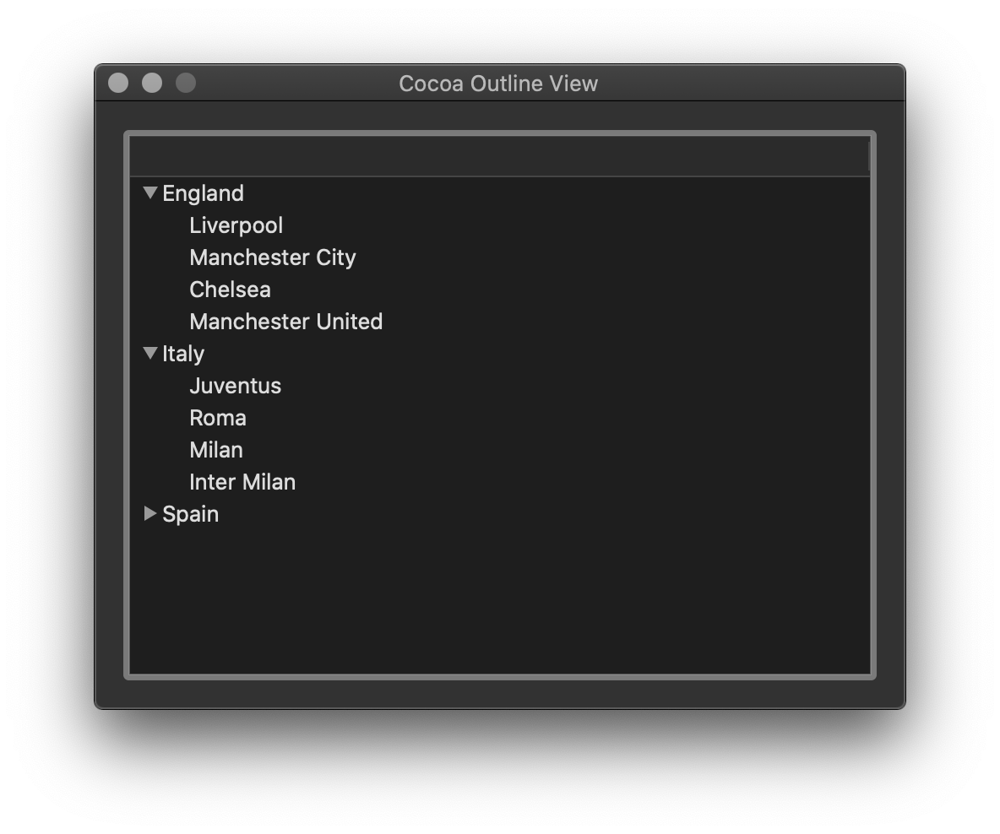

# Cocoa Outline View

This repository contains implementation of cell based NSOutlineView where data source and delegate are set programmatically.

[Cocoa macOS Examples](https://github.com/NikolaGrujic91/Cocoa-macOS-Examples)

